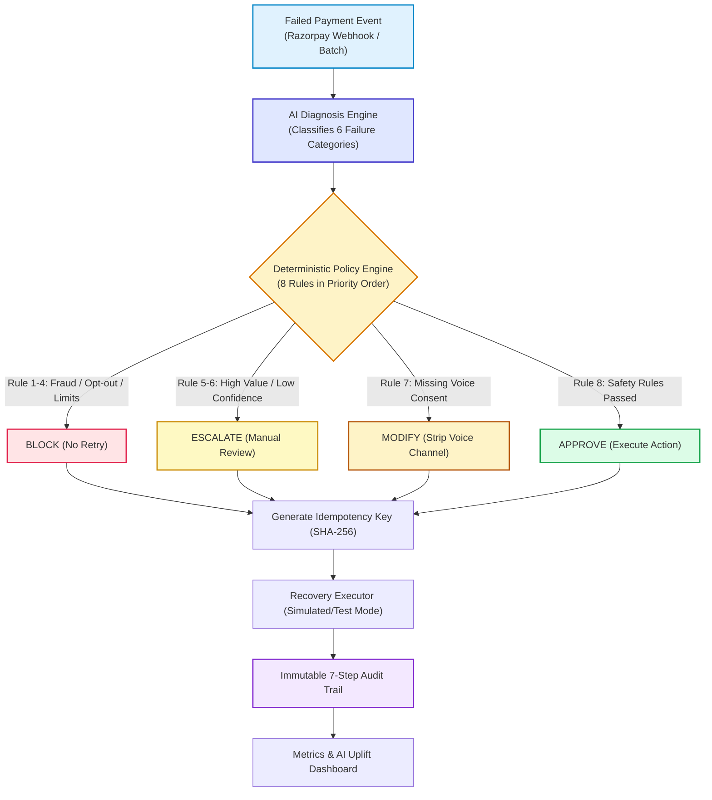
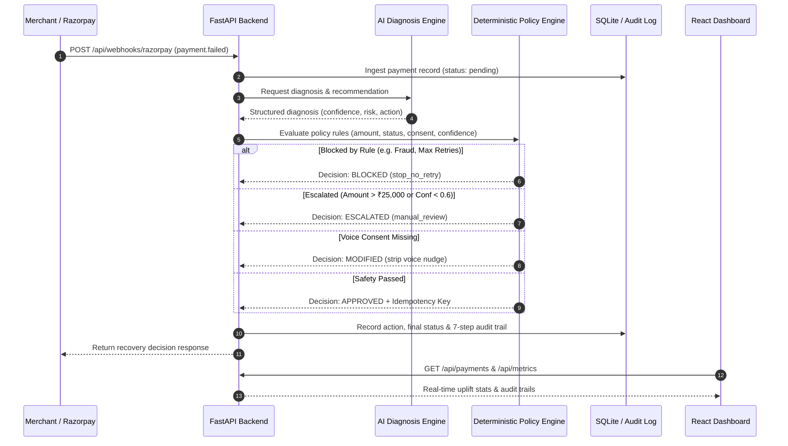
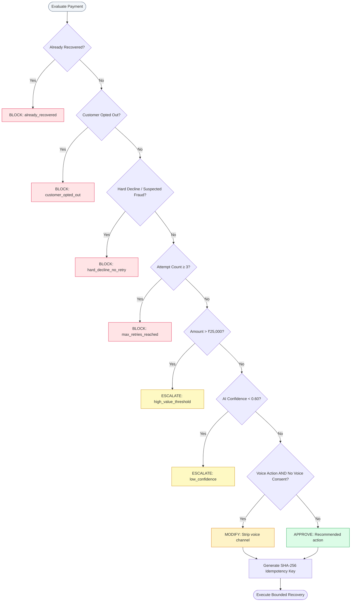

# RecoverIQ: Policy-Gated AI Revenue Recovery Agent

> **"The LLM proposes; the policy engine disposes."**

A policy-gated revenue recovery engine engineered for the **Razorpay AI Builder Internship 2026 Buildathon** (Track: *AI Revenue Recovery*).

[](https://github.com/anishahuja1/RecoverIQ-policy-gated-recovery-agent)
[](https://www.python.org/)
[](https://fastapi.tiangolo.com/)
[](https://reactjs.org/)
[](LICENSE)

---

## 1. Problem Statement

Payment failures in Indian e-commerce and SaaS cost merchants up to 20–30% of potential GMV. Traditional solutions fall into two flawed extremes:
1. **Blind Retries**: Repeatedly submitting failed transactions without context, leading to card network fraud flags, excessive interchange fees, and customer frustration.
2. **Unconstrained Autonomous AI**: Directing an LLM to take actions on financial transactions risks prompt injections, double charges, retrying invalid/stolen cards, or violating customer communication consent.

---

## 2. The RecoverIQ Solution

**RecoverIQ** introduces an institutional-grade, policy-governed recovery loop where **AI advises, but deterministic code governs**:



---

## 3. System Architecture & Workflows

### End-to-End System Workflow



---

## 4. Policy Engine Decision Matrix

Rules are evaluated in strict priority order in `backend/app/policy.py`. **First match wins**:



---

## 5. Proven AI Uplift vs. Blind Retry Baseline

RecoverIQ was benchmarked against an industry-standard heuristic **Blind Retry Baseline** on 50 synthetic transactions across 6 failure categories:

| Metric | Blind Retry (Baseline) | RecoverIQ (AI + Policy) | Net AI Uplift |
|---|:---:|:---:|:---:|
| **Recovery Rate** | **12.0%** (6/50) | **38.0%** (19/50) | **+26.0 percentage points** |
| **Recovered Revenue** | ₹13,297.00 | **₹71,993.00** | **+₹58,696.00 extra** |
| **Total At-Risk GMV** | ₹2,86,348.00 | ₹2,86,348.00 | — |
| **Fraud & High-Risk Retries** | Retries blindly | **13 Blocked** by policy | **100% fraud protection** |
| **High-Value Exposure** | Retried automated | **4 Escalated** to humans | Zero unmonitored risk |
| **Pending Customer Action** | None (failed) | **5 Reminders sent** | Active pipeline |

---

## 6. Native Razorpay Webhook Ingestion (`POST /api/webhooks/razorpay`)

RecoverIQ natively consumes Razorpay `payment.failed` webhook events:

```bash
curl -X POST http://localhost:8000/api/webhooks/razorpay \
  -H "Content-Type: application/json" \
  -d '{
    "entity": "event",
    "event": "payment.failed",
    "payload": {
      "payment": {
        "entity": {
          "id": "pay_rzp_demo101",
          "amount": 499900,
          "currency": "INR",
          "method": "upi",
          "error_code": "BAD_REQUEST_ERROR",
          "error_description": "Bank network timeout occurred during authorization",
          "error_reason": "bank_timeout",
          "notes": { "customer_name": "Rahul Sharma" }
        }
      }
    }
  }'
```

**Response:**
```json
{
  "status": "processed",
  "event": "payment.failed",
  "payment_id": "pay_rzp_demo101",
  "category": "soft_decline",
  "policy_decision": "approved",
  "selected_action": "retry_later",
  "idempotency_key": "idem_4f8b91c201a4e27f09bb",
  "recovery_status": "recovered",
  "recovered_amount": 4999.0
}
```

---

## 7. Automated Test Suite (17 Tests)

The repository includes a comprehensive `pytest` suite ensuring all policy rules, idempotency algorithms, and endpoints behave deterministically:

```bash
cd backend
python -m pytest tests/ -v
```

```text
tests/test_recoveriq.py::test_rule1_already_recovered_is_blocked PASSED     [  5%]
tests/test_recoveriq.py::test_rule2_opted_out_customer_is_blocked PASSED    [ 11%]
tests/test_recoveriq.py::test_rule3_hard_decline_is_blocked_no_retry PASSED [ 17%]
tests/test_recoveriq.py::test_rule4_max_retries_exhausted_is_blocked PASSED [ 23%]
tests/test_recoveriq.py::test_rule5_high_value_transaction_is_escalated PASSED [ 29%]
tests/test_recoveriq.py::test_rule6_low_confidence_ai_is_escalated PASSED [ 35%]
tests/test_recoveriq.py::test_rule7_voice_consent_suppresses_voice_channel PASSED [ 41%]
tests/test_recoveriq.py::test_rule8_standard_approved_action PASSED         [ 47%]
tests/test_recoveriq.py::test_idempotency_key_deterministic_and_unique PASSED [ 52%]
tests/test_recoveriq.py::test_diagnosis_demo_all_six_categories PASSED      [ 58%]
tests/test_recoveriq.py::test_simulate_recovery_blocked PASSED              [ 64%]
tests/test_recoveriq.py::test_simulate_recovery_approved_success PASSED     [ 70%]
tests/test_recoveriq.py::test_simulate_blind_retry_eligibility PASSED       [ 76%]
tests/test_recoveriq.py::test_api_health PASSED                             [ 82%]
tests/test_recoveriq.py::test_api_seed_and_payments PASSED                  [ 88%]
tests/test_recoveriq.py::test_api_run_batch_and_metrics PASSED              [ 94%]
tests/test_recoveriq.py::test_razorpay_webhook_ingestion PASSED             [100%]

======================= 17 passed in 0.89s =======================
```

---

## 8. Quickstart Guide (Run Locally in 2 Minutes)

### Prerequisites
* Python 3.11+
* Node.js 18+ and npm

### 1. Backend Setup
```bash
cd backend
pip install -r requirements.txt
python -m pytest tests/ -v
uvicorn app.main:app --reload --port 8000
```
API runs at `http://localhost:8000`. Test endpoint: `http://localhost:8000/health`.

### 2. Frontend Setup
```bash
cd frontend
npm install
npm run dev
```
Dashboard opens at `http://localhost:5173`.

### 3. Usage
1. Open `http://localhost:5173`
2. Click **"▶ Run Recovery Batch"** to execute all 50 transactions through the AI + Policy pipeline.
3. Filter by **Recovered**, **Blocked**, or **Escalated**.
4. Click **"▼ Audit"** on any transaction to inspect the complete 7-step decision log with idempotency keys.
5. Listen to the Hinglish voice nudge preview card for checkout dropouts.

---

## 9. Cloud Deployment Guide

### Backend (Render / Railway)
* **Root Directory**: `backend`
* **Build Command**: `pip install -r requirements.txt`
* **Start Command**: `uvicorn app.main:app --host 0.0.0.0 --port 8000`

### Frontend (Vercel)
* **Root Directory**: `frontend`
* **Build Command**: `npm run build`
* **Output Directory**: `dist`
* **Environment Variable**: `VITE_API_URL=https://your-backend-app.onrender.com`

---

## Tech Stack

* **Backend**: FastAPI (Python 3.11), SQLAlchemy, Pydantic v2, Pytest, Uvicorn
* **Frontend**: React 18, Vite 5, Vanilla CSS
* **Database**: SQLite (local demo) / PostgreSQL-ready via SQLAlchemy
* **Architecture**: Event-driven Webhooks, Deterministic Policy Engine, SHA-256 Idempotency Keys

---

*RecoverIQ was designed and developed for the Razorpay AI Builder Internship Buildathon (2026).*
